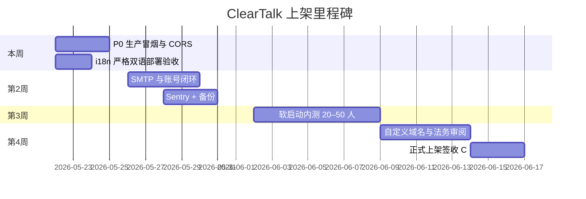

# ClearTalk 真正上架总计划

> **当前生产**  
> - Web：https://clear-talk-five.vercel.app（Vercel）  
> - API：https://cleartalk-cu84.onrender.com（Render）  
> - 仓库：`FengYue427/ClearTalk` · 分支 `main`

本文把「能打开网站」与「可对外正式运营」分开，并给出时间线与签收标准。

---

## 一、上架定义（三档）

| 档位 | 含义 | 用户感知 | 最低条件 |
|------|------|----------|----------|
| **A. 技术上线** | 前后端连通、核心路径可用 | 能注册、生成、看 35 场景 | P0 冒烟全绿 |
| **B. 软启动** | 小范围真实用户（朋友/内测群） | 账号邮件真实、配额稳定 | A + SMTP + 监控 |
| **C. 正式上架** | 公开推广、商店/社群可搜 | 品牌域名、法务完备、可付费预备 | B + 域名 + 签收单 + 7 天稳定 |

**当前评估**：Web 已达 **A 边缘**（需你方确认 Render 冒烟与注册）；尚未达 **B/C**。

---

## 二、里程碑时间线（建议 4 周）

### 第 1 周：闭环 P0（技术上线 A）

| 天 | 你方（运维） | 代理/代码侧 |
|----|--------------|-------------|
| 1–2 | Render 确认 Disk、`JWT_SECRET`、AI Key、`ALLOWED_ORIGINS` | 已 push：注册 API、i18n 零 CJK |
| 2 | Vercel 确认 `VITE_API_URL`、强刷验收英文 | `npm run launch:verify` |
| 3 | 按 [`LAUNCH_RUNBOOK.md`](LAUNCH_RUNBOOK.md) §4 冒烟 10 步 | 修 P0 bug |
| 4–5 | 填 [`LAUNCH_SIGNOFF.md`](LAUNCH_SIGNOFF.md) B 表 | 更新 Runbook 故障项 |

**出口**：注册 → 填表 → 生成 → 反馈 → 配额 全通；英文模式无汉字漏网。

### 第 2 周：可运营（软启动 B）

| 任务 | 说明 |
|------|------|
| SMTP | 生产关闭验证码/重置链接 JSON 回显（见 `backend` 邮箱配置） |
| Sentry | 前端 DSN + API 异常 |
| SQLite 备份 | Render Cron 或每周复制 `cleartalk.db` |
| 自定义域名（可选） | `app.cleartalk.*` → Vercel；API 子域 → Render |
| 内测 20–50 人 | 收集：生成成功率、反馈率、英文路径 |

### 第 3–4 周：正式上架（C）

| 任务 | 说明 |
|------|------|
| 法务 | 隐私/条款/disclaimer 中英或律师审阅 |
| 宣传口径 | **仅 Vite Web 主站**；Flutter 标「即将上架」若未上架商店 |
| Pro 预备 | 白名单内测 → 后续 Stripe/微信（阶段 11） |
| 监控 7 天 | `/health/ready` >99%；5xx <0.5% |
| 签收 | [`LAUNCH_SIGNOFF.md`](LAUNCH_SIGNOFF.md) C/D 全勾 |

---

## 三、P0 检查表（本周必做）

复制到笔记逐项打勾：

- [ ] `https://cleartalk-cu84.onrender.com/health/ready` → `status: ok`
- [ ] Vercel 环境变量 `VITE_API_URL` = Render 根 URL（无尾斜杠）
- [ ] `ALLOWED_ORIGINS` 含 `https://clear-talk-five.vercel.app`
- [ ] 注册新账号（非 405/403）
- [ ] 英文模式：35 场景名 + 任一场景表单标签/选项无中文
- [ ] 生成文本（proxy）成功，配额递减
- [ ] `public/privacy.html` 可访问
- [ ] Admin：`FEEDBACK_ADMIN_KEY` 可看统计

---

## 四、产品路线（上架后优先级）

与 [`POST_LAUNCH_ROADMAP.md`](POST_LAUNCH_ROADMAP.md) 对齐，压缩为决策顺序：

| 阶段 | 时间 | 重点 | 不做 |
|------|------|------|------|
| **9 运营稳固** | 0–4 周 | SMTP、Sentry、备份、CI `launch:verify` | 新大功能 |
| **10 体验增长** | 1–2 月 | 语气 UI、市场 UGC、Admin 看板、法务双语页 | 支付 |
| **11 商业化** | 有 DAU | Stripe/微信、Postgres | 过度智能化 |
| **12 智能化** | 有留存 | 粘贴多轮、推荐排序、ja/ko | 企业版 |

**i18n 严格双语（8d）**：已完成 451 条映射 + 构建时 EN 零 CJK 校验 → 阶段 10 中「字段 100% 英文化」可标为 ✅。

---

## 五、风险与决策

| 风险 | 影响 | 缓解 |
|------|------|------|
| Render 免费休眠 | 首请求慢、用户流失 | 升级计划或 Uptime ping |
| SQLite 单点 | 丢数据 | Disk 备份 + 日后 Turso |
| 邮箱未配 | 账号无法验证 | 软启动前必须 SMTP |
| PWA 旧缓存 | 仍见中文/旧 API | Runbook 强刷说明；`skipWaiting` 已开 |
| API 路由未实现 | 改密/删号 404 | UI 暂本地；P1 补路由或隐藏按钮 |

---

## 六、文档索引

| 文档 | 用途 |
|------|------|
| [`LAUNCH_RUNBOOK.md`](LAUNCH_RUNBOOK.md) | 部署步骤与冒烟 |
| [`LAUNCH_CHECKLIST.md`](LAUNCH_CHECKLIST.md) | 功能清单对照 |
| [`LAUNCH_SIGNOFF.md`](LAUNCH_SIGNOFF.md) | 签收表 |
| [`PLAN_S7_LAUNCH_ALIGNMENT.md`](PLAN_S7_LAUNCH_ALIGNMENT.md) | S7 缺口与 Web/Flutter 对照 |
| [`POST_LAUNCH_ROADMAP.md`](POST_LAUNCH_ROADMAP.md) | 上市后 9–12 阶段 |
| [`ROADMAP.md`](ROADMAP.md) | 总路线图 |

---

## 七、每周同步建议（15 分钟）

1. P0 冒烟是否仍绿  
2. 内测人数与「完成至少 1 次生成」比例  
3. 反馈率、5xx（有 Sentry 后）  
4. 下周只选 **1 个** P0/P1 项，避免并行铺功能  

**下一动作（建议今天）**：跟 [`POST_DEPLOY_DAY1.md`](POST_DEPLOY_DAY1.md) → 配 SMTP [`SMTP_RENDER_SETUP.md`](SMTP_RENDER_SETUP.md) → 发内测 [`BETA_INVITE.md`](BETA_INVITE.md)

**一键检查 API**：`npm run verify:production`
